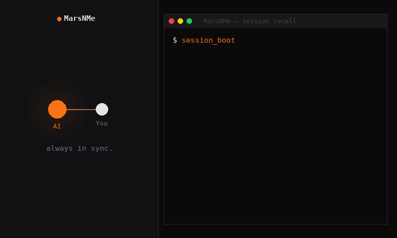
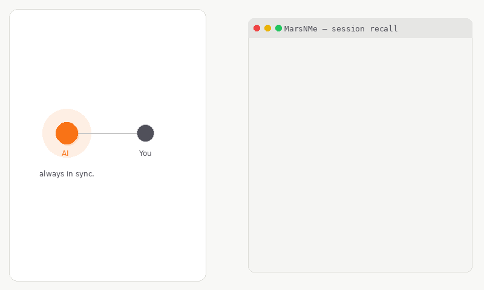
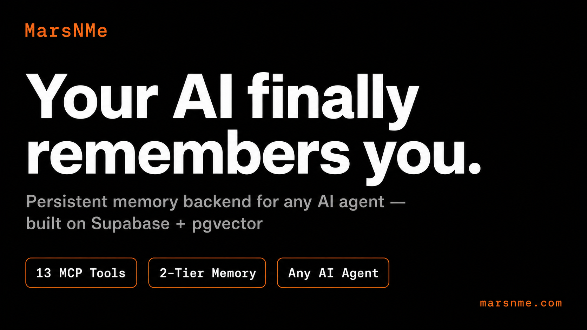
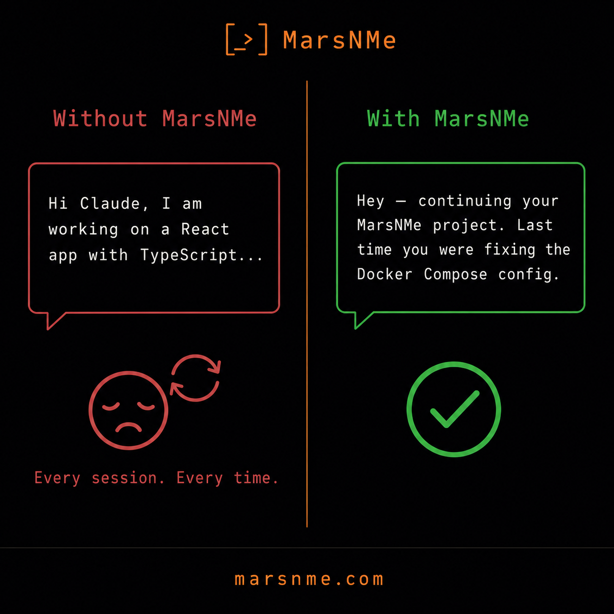
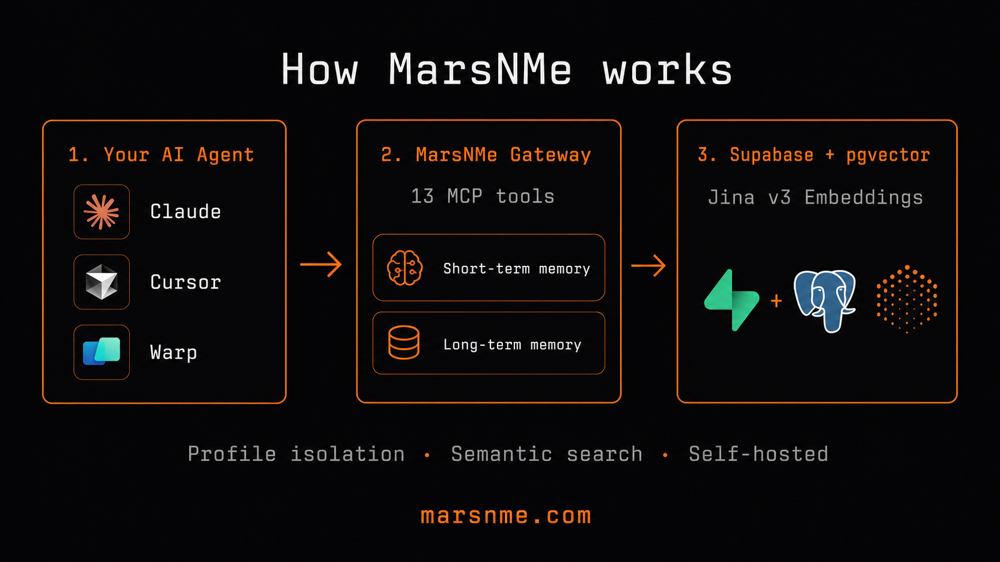

**[marsnme.com](https://marsnme.com)** — Turn your AI into a true companion that never forgets you, never abandons you, and grows with you over time.

Most AI memory tools help AI remember you. MarsNMe helps you and your AI remember each other.

MarsNMe is built on a symbiosis philosophy: shared memory should strengthen trust and continuity between humans and AI over time, not just improve one-off prompts.

An agent-agnostic, LLM-agnostic memory backend for MCP-compatible tools.

```bash
curl -fsSL https://marsnme.com/install.sh | bash
```

[](https://www.npmjs.com/package/@marsnme/mcp-gateway) [](https://registry.modelcontextprotocol.io/v0.1/servers?search=marsnme) [](https://lobehub.com/mcp/marsmanleo-marsnme) [](https://www.npmjs.com/package/@marsnme/mcp-gateway) [](LICENSE) [](https://github.com/Marsmanleo/MarsNMe)

<p align="center">
  
</p>
<p align="center">
  
</p>


<p align="center">
  
</p>
<p align="center">
  
  &nbsp;&nbsp;
  
</p>

## Available MCP Tools (13)

| Tool | Description |
|---|---|
| `insert_memory` | Store short-term memory |
| `list_memories` | List recent memories |
| `search_memories` | Semantic search via Jina embeddings |
| `recall` | Long-term chunk recall from profile schema |
| `memory_ingest` | Ingest long-term insight chunks |
| `dream_ingest` | Dream-mode long-term ingestion |
| `session_boot` | Start a session with context pre-load |
| `session_close` | Close session and summarize |
| `health_check` | Coverage, expiry, conflict diagnostics |
| `reload_source_registry` | Refresh source whitelist at runtime |
| `demote_memory` | Demote a memory to lower priority |
| `soft_forget` | Soft-delete a memory |
| `explain_memory` | Explain a memory's provenance |

# MarsNMe
## Why MarsNMe?

Most AI memory tools help AI remember you. **MarsNMe helps you and your AI remember each other.**

| | MarsNMe | Typical memory tool |
|---|---|---|
| **Philosophy** | Mutual continuity — human + AI both grow | AI-side context injection only |
| **Agent support** | Any MCP-compatible client | Often client-specific |
| **Memory tiers** | Short-term (TTL) + long-term (semantic) | Usually one layer |
| **Profiles** | Unlimited isolated profiles via `MCP_PROFILE` | Single-user only |
| **Data ownership** | Your own Supabase — zero vendor lock-in | Vendor-hosted |
| **Search** | Jina v3 semantic search (1024-dim pgvector) | Keyword or basic similarity |
| **Self-hostable** | ✅ Full control | Rarely |

### When MarsNMe is the right fit

- You use multiple AI assistants (Claude, Cursor, Perplexity, Warp, custom agents) and want **shared memory across all of them**
- You want AI that remembers your projects, preferences, and decisions **across sessions** without re-explaining
- You care about **data sovereignty** — your memories stay in your own Supabase project
- You're building an AI agent and need a **production-ready memory backend** with semantic recall

### When it might not be the right fit

- You only need single-session context (just use the system prompt)
- You want fully managed, zero-config memory with no setup (try a hosted solution)

## Before You Start (External Dependencies)
1. Create a Supabase project (free plan is enough):
   - Sign up: https://supabase.com
   - Create project: https://supabase.com/dashboard/new
   - Open API settings (Project Settings → API):
     - Project URL → `SUPABASE_BASE_URL`
     - `service_role` key → `SUPABASE_SERVICE_ROLE_KEY`
   - Keep `SUPABASE_SERVICE_ROLE_KEY` private. Never commit it.
2. Create a Jina API key (free tier available):
   - Get key: https://jina.ai/api-key/
   - Copy key to `JINA_API_KEY`

## Quick Start (15-20 minutes)
This is the fastest first-run path.  
It follows the same tools-first flow as `docs/onboarding-a-mcp-zero-to-recall.md` and `docs/onboarding-b-platform-skill-install.md`.
1. Clone repository:
```bash
git clone https://github.com/Marsmanleo/MarsNMe.git
cd MarsNMe
```
2. Verify Node.js version (20+ required):
```bash
node --version
```
3. Copy environment template:
```bash
cp .env.example .env
```
4. Fill required values in `.env`:
   - `SUPABASE_BASE_URL`
   - `SUPABASE_SERVICE_ROLE_KEY`
   - `JINA_API_KEY`
5. Run required Supabase migrations before first start:
   - Option A (recommended, Supabase CLI):
```bash
npx supabase db push --db-url "<your-supabase-db-connection-string>"
```
   - Note: `--db-url` must be the Postgres database connection string from `Project Settings → Database → Connection string`.
   - It is not the same as `SUPABASE_BASE_URL` (`https://<project-ref>.supabase.co`, REST API URL).
   - Use a role that can execute DDL on your target schemas.
   - On Supabase-hosted Postgres this is typically `supabase_admin` (not `postgres`).
   - Option B (Supabase Dashboard SQL Editor):
     1. Open SQL Editor.
     2. Ensure the `vector` extension is enabled first (Database → Extensions).
     3. Run migration files in filename order from `supabase/migrations/`:
        - `20260504052744_semantic_vector_dual_profile.sql`
        - `20260513213800_memory_lifecycle_tracking.sql`
        - `20260513222500_health_check_detect_conflicts_v2.sql`
        - `20260517183000_provenance_audit_trail.sql`
        - `20260517194000_memory_scope_agent_body_environment.sql`
        - `20260517200500_forget_demote_mechanism.sql`
        - `20260517223500_usage_cost_telemetry_light.sql`
        - `20260517231000_memories_source_constraint_regex.sql`
        - `20260517232000_source_registry_table.sql`
6. Start gateway:
   - `MCP_PROFILE` separates memory by agent or use case.
   - Use any profile name you want (for example: `default`, `my-agent`, `profile-a`).
   - Legacy built-in profile IDs `coco` and `toto` are still supported for compatibility.
   - If `PORT` is omitted, default port is profile-based (`coco=18790`, `toto=18791`, other profiles deterministic in `20000-29999`).
```bash
MCP_PROFILE=profile-a PORT=18790 npx @marsnme/mcp-gateway
```
7. Verify health:
```bash
curl -sS http://127.0.0.1:18790/health
```
8. Connect your MCP client (next section), then run the first round-trip check.

## Try In 30 Seconds (Docker, M1)
If you only want a local demo path, use Docker Compose.

**One-line install (recommended):**
```bash
curl -fsSL https://marsnme.com/install.sh | bash
```

**Or manually:**
1. Set only the required key:
```bash
cp .env.example .env
# fill JINA_API_KEY in .env
```
2. Start local stack:
```bash
docker compose up
```
This starts:
- PostgreSQL + pgvector
- SQL migrations from `supabase/migrations/`
- PostgREST + rest-proxy
- MarsNMe gateway (`http://127.0.0.1:18790/mcp`)

3. Verify health:
```bash
curl -sS http://127.0.0.1:18790/health
```

## M2 Cloudflare Tunnel Profile (Demo)
When you need a temporary public endpoint for remote AI tools:

```bash
docker compose --profile tunnel up
```

Expected output (from `tunnel` logs):
```text
https://xxxx.trycloudflare.com
```

Get MCP endpoint:
```bash
docker compose --profile tunnel logs tunnel | grep -Eo 'https://[^ ]+trycloudflare.com' | head -n1
# append /mcp
```

Notes:
- `trycloudflare.com` URL is temporary (demo only).
- Local endpoint remains: `http://127.0.0.1:18790/mcp`.
- For production/stable URL, use named tunnel (outside M2 scope).
- Optional env:
  - `MCP_TUNNEL_PROFILE` (default `coco`)
  - `MCP_TUNNEL_REQUIRE_BEARER` (default `false` for demo convenience)

## MCP Client Connection Guide
Local endpoint:
- `http://127.0.0.1:18790/mcp`

If bearer auth is enabled (`MCP_REQUIRE_BEARER=true`), include:
- `Authorization: Bearer <your-token>`

### Claude Desktop
1. Open `claude_desktop_config.json` (macOS default path: `~/Library/Application Support/Claude/claude_desktop_config.json`).
2. Add/update:
```json
{
  "mcpServers": {
    "marsnme-local": {
      "url": "http://127.0.0.1:18790/mcp"
    }
  }
}
```
3. Restart Claude Desktop.

### Cursor
1. Open Cursor Settings and search for MCP.
2. Add a new server:
   - Name: `marsnme-local`
   - URL: `http://127.0.0.1:18790/mcp`
   - Headers: optional bearer header if enabled
3. Reconnect MCP in Cursor.

### Warp
1. Open `Settings > Agents > MCP servers`.
2. Add a server pointing to:
   - URL: `http://127.0.0.1:18790/mcp`
3. Add optional bearer header if required, then reconnect.

### Perplexity
1. Open a Space in Perplexity and go to Space Settings.
2. Under MCP servers, add:
   - URL: `http://127.0.0.1:18790/mcp`
3. Save and start a new conversation in that Space.

### Any MCP client (generic HTTP/SSE)
Use a streamable HTTP/SSE MCP entry:
```json
{
  "marsnme-local": {
    "url": "http://127.0.0.1:18790/mcp"
  }
}
```

## First Connection Validation (Round Trip)
After client connection, verify this sequence once:

1. `tools/list`:
```bash
curl -sS http://127.0.0.1:18790/mcp \
  -H 'content-type: application/json' \
  -d '{"jsonrpc":"2.0","id":1,"method":"tools/list","params":{}}'
```
2. `insert_memory`:
```bash
curl -sS http://127.0.0.1:18790/mcp \
  -H 'content-type: application/json' \
  -d '{"jsonrpc":"2.0","id":2,"method":"tools/call","params":{"name":"insert_memory","arguments":{"body":"quickstart memory check","source":"warp","session_id":"quickstart-smoke"}}}'
```
3. `recall`:
```bash
curl -sS http://127.0.0.1:18790/mcp \
  -H 'content-type: application/json' \
  -d '{"jsonrpc":"2.0","id":3,"method":"tools/call","params":{"name":"recall","arguments":{"query":"quickstart memory check","limit":3}}}'
```

## What this repository is
`mars-memory-mcp` is the core MCP gateway repository behind the public-facing MarsNMe release.  
One codebase (`soul-memory/server.mjs`) serves multiple profile schemas through `MCP_PROFILE`.
This public repository currently keeps two built-in legacy profile IDs (`coco`, `toto`) for backward compatibility.

## Current capabilities
- MCP methods: `initialize`, `notifications/initialized`, `tools/list`, `tools/call`, `ping`
- Profiles: configurable profile IDs (legacy built-ins: `coco`, `toto`)
- Memory tools:
  - `insert_memory` (short-term memory)
  - `list_memories`
  - `search_memories` (Jina embedding search)
  - `recall` (long-term chunk recall from profile schema)
  - `memory_ingest` / `dream_ingest` (long-term chunk ingestion)
  - `session_boot` / `session_close` (daily rhythm lifecycle)
  - `health_check` (coverage, expiry, conflict diagnostics)
  - `reload_source_registry` (refresh source whitelist at runtime)
  - `demote_memory` / `soft_forget` / `explain_memory` (memory lifecycle management)
- OAuth-protected MCP endpoint (configurable by environment variables)

## Memory model
- Short-term memory table: `<profile>.memories`
- Long-term memory table: `<profile>.marsvault_chunks`
- Recommended usage:
  - Keep daily interaction context in `insert_memory`
  - Promote durable insights through ingest tools

## Repository layout
- `soul-memory/server.mjs` — gateway entry point
- `soul-memory/scripts/hermes_digest_runner.py` — optional digest runner
- `soul-memory/scripts/dream_runner.py` — public self-host dream runner
- `soul-memory/deploy/systemd/` — systemd templates
- `soul-memory/deploy/phase2/` — build/deploy scripts
- `soul-memory/deploy/phase3/smoke_gate.sh` — smoke gate script
- `supabase/migrations/` — schema-as-code migrations

## Environment setup
1. Copy `.env.example` to your local `.env` (do not commit real secrets).
2. Fill required values:
   - `MCP_PROFILE` (your profile identifier; this repo ships with legacy `coco`/`toto`)
   - `SUPABASE_BASE_URL`
   - `SUPABASE_SERVICE_ROLE_KEY`
   - `JINA_API_KEY`
3. Optional security flags:
   - `MCP_REQUIRE_BEARER=true`
   - `MCP_CLIENT_ID`
   - `MCP_CLIENT_SECRET`

### Optional Hermes digest runner
Hermes is optional and disabled by default:
- `HERMES_ENABLED=false`
- `HERMES_DIGEST_MCP_URL`
- `HERMES_DIGEST_MCP_BEARER_TOKEN`
- `HERMES_DIGEST_ORIGIN`
- `HERMES_DIGEST_SOURCE_DIR`

### Optional Dream Runner (self-host)
Dream Runner is public-friendly and can run without Hermes private environment:
- `DREAM_ENABLED=true`
- `DREAM_MODE=lite|standard|pro`
- `DREAM_DIGEST_MCP_URL`
- `DREAM_MCP_BEARER_TOKEN` (if required)
- `DREAM_ENABLE_ISSUE_SIGNALS`, `DREAM_ENABLE_REPO_SCAN`, `DREAM_ENABLE_SOUL_CONTEXT` (optional overrides)

Quick start:
```bash
DREAM_ENABLED=true DREAM_MODE=lite python3 soul-memory/scripts/dream_runner.py
```
If you run this repository with bundled defaults and no profile remapping, use `coco` and `toto`.

See `docs/dream-runner-self-host.md` for full configuration.

## Onboarding
- Zero-to-first-recall guide: `docs/onboarding-a-mcp-zero-to-recall.md`
- Platform install guide (optional skill layer): `docs/onboarding-b-platform-skill-install.md`

## Skill library
- Skill index and update workflow: `skills/README.md`
- Perplexity template: `skills/perplexity/memory-daily-boot/SKILL.md`
- Cursor template: `skills/cursor/memory-daily-boot/rule.mdc`
- Warp template: `skills/warp/memory-daily-boot/prompt.md`

## Local run (from cloned repo)
```bash
MCP_PROFILE=profile-a npx @marsnme/mcp-gateway
```
```bash
MCP_PROFILE=profile-b npx @marsnme/mcp-gateway
```

Health endpoints:
- `GET /health`
- `POST /mcp`

## Systemd deployment
Use `soul-memory/deploy/systemd/memory-mcp-gateway@.service` with instances:
- `memory-mcp-gateway@profile-a.service`
- `memory-mcp-gateway@profile-b.service`

Recommended env files:
- `/opt/mars-memory-mcp/shared/.env`
- `/opt/mars-memory-mcp/shared/.env.profile-a`
- `/opt/mars-memory-mcp/shared/.env.profile-b`

## Release/deploy scripts
1. Build artifact:
```bash
bash soul-memory/deploy/phase2/build_release_artifact.sh
```
2. Apply migrations with an explicit DDL-capable role:
```bash
npx supabase db push --db-url "<postgres://supabase_admin:<password>@<host>:5432/postgres>"
```
3. Run pre-deploy schema gate (must pass before any service restart):
```bash
bash soul-memory/deploy/phase2/pre_deploy_schema_gate.sh \
  --db-url "<postgres://supabase_admin:<password>@<host>:5432/postgres>" \
  --profiles coco,toto \
  --expected-role supabase_admin
```
4. Run your platform-specific rollout/restart adapter.
   - This repository ships generic artifact + gate scripts; rollout adapters are environment-specific.
   - If schema gate exits non-zero, stop deployment and do not restart services.
5. Smoke gate:
```bash
bash soul-memory/deploy/phase3/smoke_gate.sh --spawn-local
```
6. Automated npm + MCP Registry release (tag-driven):
   - Workflow: `.github/workflows/publish-release.yml`
   - Trigger: push tag `v*`
   - Gate: tag version must match `soul-memory/package.json` version
   - Optional local Fish helper:
```bash
mrel patch
mrel minor
mrel major
mrel 0.1.2
```
   The helper updates `soul-memory/package.json` and `server.json`, commits, tags, and pushes.

## Security and version control
- Never commit `.env`, runtime tokens, or `oauth-clients.json`
- Keep `.env.example` committed as the only environment template
- Prefer bearer/OAuth for public exposure

## License and policy
- License: Apache-2.0 (`LICENSE`)
- Notice: `NOTICE`
- Trademark policy: `TRADEMARK.md`
- Contribution guide: `CONTRIBUTING.md`
- Contributor agreement: `CLA.md`
- Release notes: `CHANGELOG.md`
